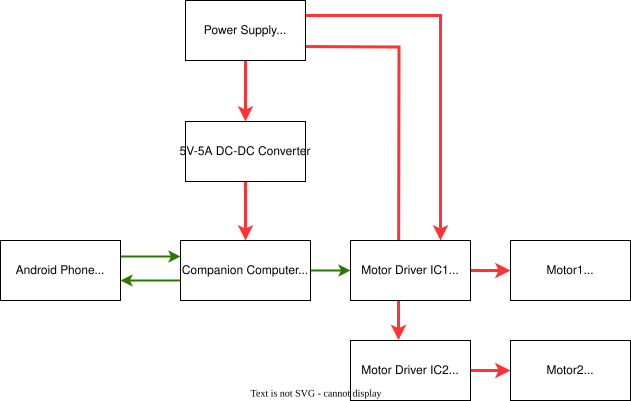
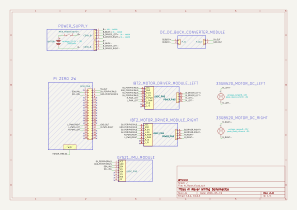

# unmanned-rover

🚧 <b>Still in Progress</b> 🚧

<b>Keywords:</b> Unmanned Ground Vehicle (UGV) • Offline Mapping & Online Localization • Deep Learning • Computer Vision

Go from a place to another place on an offline map, avoid obstacles using neural network, utilize home-available hardware, buy as little as possible.

# Hardware Block Diagram

# Wiring schematic

# System Block diagram